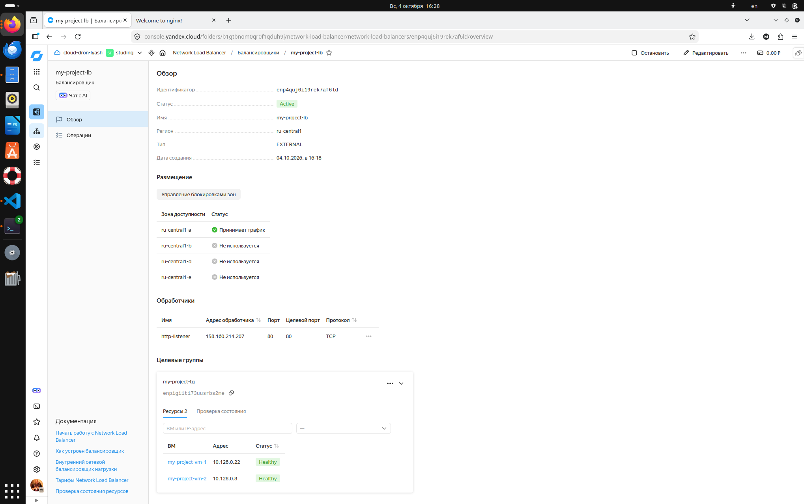
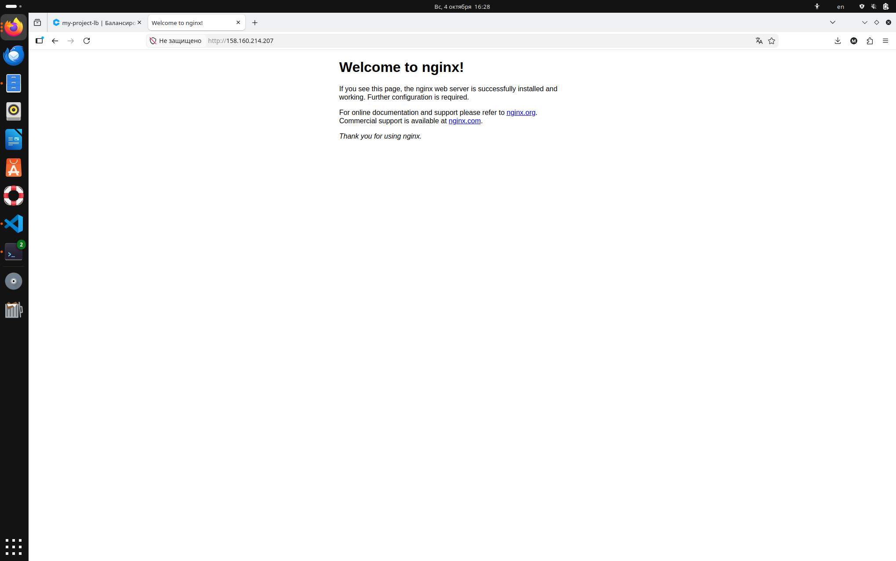

# Домашнее задание к занятию «Отказоустойчивость в облаке»

**Выполнил:** Андрей Лященко

---

## Задание 1

### Terraform Playbook

#### `provider.tf`
```hcl
terraform {
  required_providers {
    yandex = {
      source  = "yandex-cloud/yandex"
      version = "~> 0.133.0"
    }
  }
}

provider "yandex" {
  service_account_key_file = var.sa_key_file
  cloud_id                 = var.cloud_id
  folder_id                = var.folder_id
  zone                     = var.zone
}
```

#### `variables.tf`
```hcl
variable "vm_name_prefix" {
  type        = string
  description = "Префикс для имен ВМ и сети"
  default     = "my-project"
}

variable "zone" {
  type        = string
  description = "Зона доступности"
  default     = "ru-central1-a"
}

variable "preemptible" {
  type        = bool
  description = "Флаг прерываемой ВМ"
  default     = false
}

variable "ssh_public_key" {
  type        = string
  description = "Путь к публичному SSH-ключу"
  default     = "~/.ssh/id_rsa.pub"
}

variable "ubuntu_image_family" {
  type        = string
  description = "Семейство образа Ubuntu"
  default     = "ubuntu-2204-lts"
}

variable "debian_image_family" {
  type        = string
  description = "Семейство образа Debian"
  default     = "debian-12"
}

variable "ubuntu_user" {
  type        = string
  default     = "ubuntu"
}

variable "debian_user" {
  type        = string
  default     = "debian"
}

variable "sa_key_file" {
  type        = string
  description = "Путь к файлу ключа сервисного аккаунта (JSON)"
  default     = "./key.json"
}

variable "cloud_id" {
  type        = string
  description = "Идентификатор облака в Yandex Cloud"
}

variable "folder_id" {
  type        = string
  description = "Идентификатор каталога (folder) в Yandex Cloud"
}

variable "ssh_private_key" {
  description = "Путь к приватному SSH-ключу для подключения к ВМ"
  type        = string
  default     = "~/.ssh/id_rsa"
}
```

#### `main.tf`
```hcl
# ============================================================
# 1. EXISTING SUBNET (data source)
# ============================================================

data "yandex_vpc_subnet" "hw_subnet" {
  subnet_id = "e9bc4s4hl9bq2kkke770"
}

# ============================================================
# 2. UBUNTU IMAGE (data source)
# ============================================================

data "yandex_compute_image" "ubuntu" {
  family = var.ubuntu_image_family
}

# ============================================================
# 3. TWO IDENTICAL VMs VIA COUNT
# ============================================================

resource "yandex_compute_instance" "hw_vm" {
  count = 2

  name        = "${var.vm_name_prefix}-vm-${count.index + 1}"
  platform_id = "standard-v3"
  zone        = var.zone

  resources {
    cores  = 2
    memory = 2
  }

  boot_disk {
    initialize_params {
      image_id = data.yandex_compute_image.ubuntu.id
      size     = 10
    }
  }

  network_interface {
    subnet_id = data.yandex_vpc_subnet.hw_subnet.id
    nat       = true
  }

  metadata = {
    ssh-keys = "ubuntu:${file(var.ssh_public_key)}"
  }

  scheduling_policy {
    preemptible = var.preemptible
  }
}

# ============================================================
# 4. TARGET GROUP
# ============================================================

resource "yandex_lb_target_group" "hw_tg" {
  name = "${var.vm_name_prefix}-tg"

  dynamic "target" {
    for_each = yandex_compute_instance.hw_vm
    content {
      subnet_id = data.yandex_vpc_subnet.hw_subnet.id
      address   = target.value.network_interface[0].ip_address
    }
  }
}

# ============================================================
# 5. NETWORK LOAD BALANCER
# ============================================================

resource "yandex_lb_network_load_balancer" "hw_lb" {
  name = "${var.vm_name_prefix}-lb"

  listener {
    name = "http-listener"
    port = 80
    external_address_spec {
      ip_version = "ipv4"
    }
  }

  attached_target_group {
    target_group_id = yandex_lb_target_group.hw_tg.id

    healthcheck {
      name = "http-healthcheck"
      http_options {
        port = 80
        path = "/"
      }
    }
  }
}

# ============================================================
# 6. OUTPUTS
# ============================================================

output "lb_external_ip" {
  description = "External IP address of the network load balancer"
  value = one([
    for listener in yandex_lb_network_load_balancer.hw_lb.listener : one([
      for spec in listener.external_address_spec : spec.address
    ])
  ])
}

output "vm_ips" {
  description = "Internal IP addresses of the VMs"
  value       = yandex_compute_instance.hw_vm[*].network_interface[0].ip_address
}
```

### Скриншот 1: Статус балансировщика и целевой группы



### Скриншот 2: Страница Nginx по IP балансировщика

